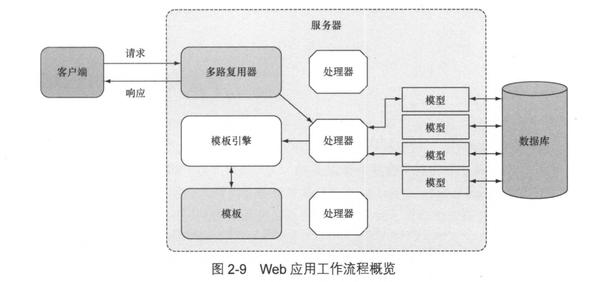
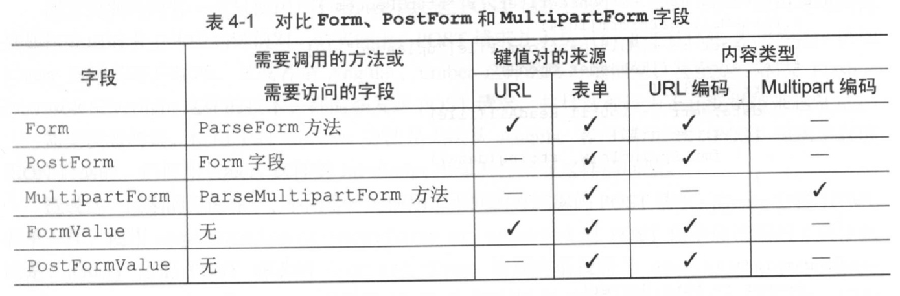
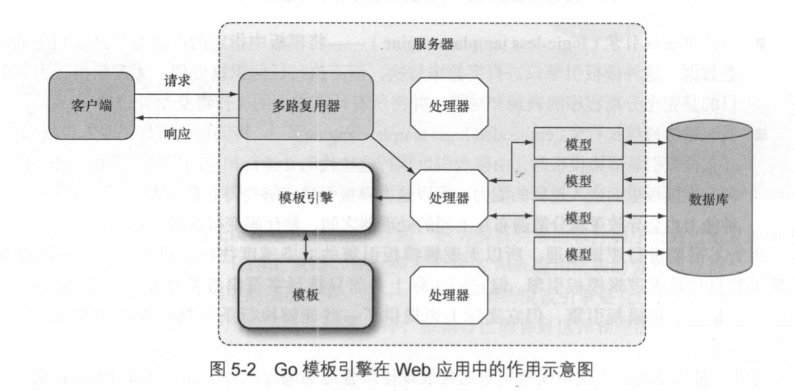

# Go Web编程--ChitChat论坛

全部代码地址：https://github.com/sausheong/gwp

Web应用的工作流程如下：
（1）客户端讲请求发送的服务器的一个 URL 上
（2）服务器的多路复用器将接收到的请求重定向到正确的处理器，然后由该处理器对请求进行处理
（3）处理器处理请求并执行必要的动作
（4）处理器调用模版引擎，生成相应的 HTML 并将其返回给客户端

**ChitChat 的数据模型：**
- User——表示论坛的用户信息
- Session——表示论坛用户当前的登录会话
- Thread——表示论坛里面的帖子，每一个帖子都记录了多个论坛用户之间的对话
- Post——表示用户在帖子里面添加的回复

**使用 cookie 进行访问控制**
代码清单2-4 route_auth.go 文件中的 authenticate 处理器函数
```go
func authenticate(w http.ResponseWriter, r *http.Request) {
    r.ParseForm()
    user, _ := data.UserByEmail(r.PostFormValue("email"))
    if user.Password == data.Encrypt(r.PostFormValue("password")){
        session := user.CreateSession()
        cookie := http.Cookie{
            Name: "_cookie",
            Value: session.Uuid,
            HttpOnly: true,
        }
        http.SetCookie(w, &cookie)
        http.Redirect(w, r, "/", 302)
    } else{
        http.Redirect(w, r, "/login", 302)
    }
}
```

代码清单2-5 util.go 文件中的 session 工具函数
```go
func session(w http.ResponseWriter, r *http.Request) (sess data.Session, err error) {
    cookie, err := r.Cookie("_cookie")
    if err == nil {
        sess = data.Session{Uuid: cookie.Value}
        if ok, _ := sess.Check(); !ok {
            err = errors.New("Invalid session")
        }
    }
    return 
}
```

数据库相关 表结构 P58




代码清单 3-5 生成个人使用的 SSL 证书以及服务器私钥
```go
package main

import (
    "crypto/rand"
    "crypto/rsa"
    "crypto/x509"
    "crypto/x509/pkix"
    "encoding/pem"
    "math/big"
    "net"
    "os"
    "time"
)

func main() {
    max := new(big.Int).Lsh(big.NewInt(1), 128)
    serialNumber, _ := rand.Int(rand.Reader, max)
    subject := pkix.Name{
        Organization:       []string{"Manning Publications Co."},
        OrganizationalUnit: []string{"Books"},
        CommonName:         "Go Web Programming",
    }

    template := x509.Certificate{
        SerialNumber: serialNumber,
        Subject:      subject,
        NotBefore:    time.Now(),
        NotAfter:     time.Now().Add(365 * 24 * time.Hour),
        KeyUsage:     x509.KeyUsageKeyEncipherment | x509.KeyUsageDigitalSignature,
        ExtKeyUsage:  []x509.ExtKeyUsage{x509.ExtKeyUsageServerAuth},
        IPAddresses:  []net.IP{net.ParseIP("127.0.0.1")},
    }

    pk, _ := rsa.GenerateKey(rand.Reader, 2048)

    derBytes, _ := x509.CreateCertificate(rand.Reader, &template, &template, &pk.PublicKey, pk)
    certOut, _ := os.Create("cert.pem")
    pem.Encode(certOut, &pem.Block{Type: "CERTIFICATE", Bytes: derBytes})
    certOut.Close()

    keyOut, _ := os.Create("key.pem")
    pem.Encode(keyOut, &pem.Block{Type: "RSA PRIVATE KEY", Bytes: x509.MarshalPKCS1PrivateKey(pk)})
    keyOut.Close()
}
```

代码清单 3-7 使用多个处理器对请求进行处理
```go
package main

import (
    "fmt"
    "net/http"
)

type HelloHandler struct {
}

func (h *HelloHandler) ServeHttp(w http.ResponseWriter, r *http.Request) {
    fmt.Fprintf(w, "Hello!")
}

type WorldHandler struct {
}

func (h *WorldHandler) ServeHttp(w http.ResponseWriter, r *http.Request) {
    fmt.Fprintf(w, "World!")
}

func main() {
    hello := HelloHandler{}
    world := WorldHandler{}

    server := http.Server{
        Addr: "127.0.0.1:8080",
    }

    http.Handle("/hello", &hello)
    http.Handle("/world", &world)

    server.ListenAndServe()
}
```

**处理器函数**
处理器函数就是与处理器拥有相同行为的函数：这些函数与 serverHTTP 方法拥有相同的签名，也就是说他们接受 ResponseWriter 和指向 Request 结构的指针作为参数

#### 3.3.4 串联多个处理器和处理器函数

代码清单3-10 串联两个处理器函数
```go
package main

import (
    "fmt"
    "net/http"
    "reflect"
    "runtime"
)

func hello(w http.ResponseWriter, r *http.Request) {
    fmt.Fprintf(w, "Hello!")
}

func log(h http.HandlerFunc) http.HandlerFunc {
    return func(w http.ResponseWriter, r *http.Request) {
        name := runtime.FuncForPC(reflect.ValueOf(h).Pointer()).Name()
        fmt.Println("Handler function called - " + name)
        h(w, r)
    }
}

func main() {
    server := http.Server{
        Addr: "127.0.0.1:8080",
    }
    http.HandleFunc("/hello", log(hello))
    server.ListenAndServe()
}
```

P82
路由匹配最小惊讶原则
程序在绑定 helloHandler 时使用的 URL 是 /hello 而不是 /hello/
如果被绑定的 URL 不是以 / 结尾，那么它只会与完全相同的 URL 匹配；但如果被绑定的 URL 以 / 结尾，那么即使请求的 URL 只有前缀部分与被绑定的 URL 相同， ServeMux 也会认为这两个 URL 是匹配的
例：
http.HandleFunc("/", indexHandler)
http.HandleFunc("/hello", helloHandler)

如果请求 /random， 因为找不到处理这个 URL 的处理器，则会交给根处理器处理，即 indexHandler
如果请求 /hello， 匹配成功，交给 helloHandler 处理器处理
如果请求 /hello/there， 因为 helloHandler 匹配的是 “/hello”，是严格匹配 “/hello”，所以 /hello/there 这个请求将会叫个根处理器处理。如果 helloHander 匹配的是“/hello/”，服务器在找不到与之完全匹配的处理器时，会退而求其次，开始寻找能够与/hello/匹配的处理器，并最终找到 helloHandler 处理器

#### 3.3.6 使用其他多路复用器
ServeMux 的一个缺陷是无法使用变量实现 URL 的模式匹配

另一个搞笑的轻量级第三方多路复用器——HttpRouter
http://github.com/julienschmidt/httprouter

代码清单3-12 使用 HttpRouter 实现的服务器 P83
```
package main

import (
    "fmt"
    "github.com/julienschmidt/httprouter"
    "net/http"
)

func hello(w http.ResponseWriter, r *http.Request, p httprouter.Params) {
    fmt.Fprintf(w, "hello, %s!\n", p.ByName("name"))
}

func main() {
    mux := httprouter.New()  // 创建多路复用器
    mux.GET("/hello/:name", hello)
    
    server := http.Server{
        Addr: "127.0.0.1:8080",
        Handler: mux,
    }
    
    server.ListenAndServe()
}
```

## 第4章 处理请求
Request 结构主要由以下部分组成
- URL 字段；
- Header 字段；
- Body 字段；
- Form 字段、PostForm 字段和 MultipartForm 字段

代码清单4-1 URL结构
```go
type URL struct {
    Scheme   string
    Opaque   string
    User     *Userinfo
    Host     string
    Path     string
    RawQuery string
    Fragment string
}
```

代码清单4-2 读取请求首部 P91
```go
package main

import (
    "fmt"
    "net/http"
)

func headers(w http.ResponseWriter, r *http.Request) {
    h := r.Header  //全部header头信息
    //h := r.Header["Accept-Encoding"]  // 返回字符串切片
    //h := r.Header.Get("Accept-Encoding")  // 返回字符串，多个首部值使用逗号分隔
    fmt.Fprintf(w, h)  // 打印header头信息
}

func main() {
    server := http.Server{
        Addr: "127.0.0.1:8080",
    }
    
    http.HandleFunc("/headers", headers)
    server.ListenAndServe()
}
```

代码清单 4-3 读取请求主体中的数据 P92
```go 
package main

import (
    "fmt"
    "net/http"
)

func body(w http.ResponseWriter, r *http.Request) {
    len := r.ContentLength
    body := make([]byte, len)
    r.Body.Read(body)
    fmt.Fprintln(w, string(body))
}

func main() {
    server := http.Server{
        Addr: "127.0.0.1:8080",
    }
    http.HandleFunc("/body", body)
    server.ListenAndServe()
}
```

代码清单4-4 对表单进行语法分析 P95
```go
package main

import (
    "fmt"
    "net/http"
)

func process(w http.ResponseWriter, r *http.Request) {
    r.ParseForm()
    fmt.Fprintln(w, r.Form)
}

func main() {
    server := http.Server{
        Addr: "127.0.0.1:8080",
    }
    http.HandleFunc("/process", process)
    server.ListenAndServe()
}
```

**如果用户只想要获取表单键值对而不是 URL 键值对，那么可以访问 Request 结构的 PostForm 字段**
PostFrom 字段只支持 application/x-www-form-urlencoded 编码

FormValue 方法即使在给定键拥有多个值的情况下，也只会从 Form 结构中取出给定键的**第一个值**



#### 4.2.4 文件

代码清单4-6 通过 MultipartForm 字段接收用户上传的文件  P100
```go
package main

import (
    "fmt"
    "io/ioutil"
    "net/http"
)

func process(w http.ResponseWriter, r *http.Request) {
    r.ParseMultipartForm(1024)
    fileHeader := r.MultipartForm.File["uploaded"][0]
    file, err := fileHeader.Open()
    if err == nil {
        data, err := ioutil.ReadAll(file)
        if err == nil {
            fmt.Fprintln(w, string(data))
        }
    }
}

func main() {
    server := http.Server{
        Addr: "127.0.0.1:8080",
    }
    http.HandleFunc("/process", process)
    server.ListenAndServe()
}
```
服务器在处理文件上传时首先要做的就是执行 ParseMultipartForm 方法，接着从 MultipartForm 字段的 File 字段里面取出文件头 FileHeader， 然后通过调用文件头的 Open 方法来打开文件

代码清单 4-7 使用 FormFile 方法获取被上传的文件
```go
package main

import (
    "fmt"
    "io/ioutil"
    "net/http"
)

func process(w http.ResponseWriter, r *http.Request) {
    file, _, err := r.FormFile("uploaded")
    if err == nil {
        data, err := ioutil.ReadAll(file)
        if err == nil {
            fmt.Fprintln(w, string(data))
        }
    }
}
```
FormFile 方法将同时返回文件和文件头作为结果。用户在使用 FormFile方法时，将不再需要手动调用 ParseMultipartForm方法，只需要对返回的文件进行处理即可

### 4.3 ResponseWriter
ResponseWriter 接口拥有3个方法：
- Write
- WriteHeader
- Header

代码清单 4-8 使用 Write 方法向客户端发送响应  P103
```go
package main

import "net/http"

func writeExample(w http.ResponseWriter, r *http.Request) {
    str := `<html>
<head><title>Go Web Programming</title></head>
<body><h1>Hello Wrold</h1></body>
</html>`
    w.Write([]byte(str))
}

func main() {
    server := http.Server{
        Addr: "127.0.0.1:8080",
    }
    http.HandleFunc("/write", writeExample)
    server.ListenAndServe()
}
```

通过 Header 方法可以去的一个由首部组成的映射，修改映射就可以修改首部，并包含到 HTTP 响应里面，一起发送至客户端

代码清单 4-10 通过编写首部实现客户端重定向 P105
```go
...
func headerExample(w http.ResponseWriter, r *http.Request) {
    w.Header().Set("Location", "http://google.com")
    w.WriterHeader(302)
}

func main() {
    ...
    http.HandleFunc("/redirect", headerExample)
    ...
}
```
**注意：因为 WriteHeader 方法在执行完毕后就不允许再对首部进行写入，所以用户必须先写入 Location 首部，然后再写入状态码**


代码清单 4-11 编写 JSON 输出   P106
```go
package main

import (
    "encoding/json"
    "fmt"
    "net/http"
)

type Post struct {
    User    string
    Threads []string
}

func jsonExample(w http.ResponseWriter, r *http.Request) {
    w.Header().Set("Content-Type", "application/json")
    post := &Post{
        User:    "Mao erniu",
        Threads: []string{"first", "second", "third"},
    }
    json, _ := json.Marshal(post)
    w.Write(json)
}

func main() {
    server := http.Server{
        Addr: "127.0.0.1:8080",
    }

    http.HandleFunc("/json", jsonExample)
    server.ListenAndServe()
}
```
### 4.4 cookie

cookie 是一种存储在客户端的、体积较小的信息，这些信息最初都是由服务器通过 HTTP 响应报文发送的。
大多数cookie都可以被划分为**会话 cookie**和**持久 cookie**两种类型

#### 4.4.1 Go 与 cookie
cookie 在Go 语言中用 Cookie 结构表示

代码清单 4-12 Cookie 结构的定义  P107
```go
type Cookie struct {
    Name       string
    Value      string
    Path       string
    Domain     string
    Expires    time.Time
    RawExpires string
    MaxAge     int
    Secure     bool
    HttpOnly   bool
    Raw        string
    Unparsed   []string
}
```
Expires 字段和 MaxAge 字段都可以用于设置 cookie 的过期时间
Expires 字段用于明确地指定 cookie 应该在什么时候过期
MaxAge 字段则指明了 cookie 在被浏览器创建出来之后能够存活多少秒

HTTP1.1 废弃了Expires，推荐使用 MaxAge 来代替 Expires，但几乎所有浏览器都仍然支持 Expires，而且IE6、IE7、IE8 都不支持 MaxAge

实际操作中 可以只使用 Expires，或者两者同时使用

#### 4.4.2 将 cookie 发送至浏览器
Cookie 结构的 String 方法可以返回一个经过序列化处理的 cookie， 其中 Set-Cookie 响应首部的值就是由这些序列化之后的 cookie 组成的

代码清单 4-13  向浏览器发送 cookie  P108
```go
package main

import "net/http"

func setCookie(w http.ResponseWriter, r *http.Request) {
    c1 := http.Cookie{
        Name:     "first_cookie",
        Value:    "Go Web Programming",
        HttpOnly: true,
    }
    c2 := http.Cookie{
        Name:     "second_cookie",
        Value:    "Manning Publications Co",
        HttpOnly: true,
    }
    w.Header().Set("Set-Cookie", c1.String())
    w.Header().Add("Set-Cookie", c2.String())
}

func main() {
    server := http.Server{
        Addr: "127.0.0.1:8080",
    }
    http.HandleFunc("/set_cookie", setCookie)
    server.ListenAndServe()
}
```
除了 Set 方法和 Add 方法，Go语言还提供了一种更为便捷方便的 cookie 设置方法，那就是使用 net/http 库中的 SetCookie 方法

代码清单 4-14 使用 SetCookie 方法设置 cookie
```go
// 省略代码和代码清单4-13一致
...
    //w.Header().Set("Set-Cookie", c1.String())
    //w.Header().Add("Set-Cookie", c2.String())
    //上面两行修改为
    http.SetCookie(w, &c1)
    http.SetCookie(w, &c2)
    ...
```

#### 4.4.3 从浏览器获取 cookie

代码清单4-15 从请求的首部获取 cookie  P111
```go
package main

import (
    "fmt"
    "net/http"
)

func setCookie(w http.ResponseWriter, r *http.Request) {
    c1 := http.Cookie{
        Name:     "first_cookie",
        Value:    "Go Web Programming",
        HttpOnly: true,
    }
    c2 := http.Cookie{
        Name:     "second_cookie",
        Value:    "Manning Publications Co",
        HttpOnly: true,
    }
    http.SetCookie(w, &c1)
    http.SetCookie(w, &c2)
}

func getCookie(w http.ResponseWriter, r *http.Request) {
    h := r.Header["Cookie"]
    fmt.Fprintln(w, h)
}

func main() {
    server := http.Server{
        Addr: "127.0.0.1:8080",
    }
    http.HandleFunc("/set_cookie", setCookie)
    http.HandleFunc("/get_cookie", getCookie)
    server.ListenAndServe()
}
```
语句 r.Header["Cookie"] 返回了一个切片，这个切片包含了一个字符串，而这个字符串又包含了客户端发送的任意多个 cookie

代码清单4-16 使用 Cookie 方法和 Cookies 方法   P111
```go
func getCookie(w http.ResponseWriter, r *http.Request) {
    c1, err := r.Cookie("first_cookie")
    if err != nil {
        fmt.Fprintln(w, "Cannot get the first cookie")
    }
    cs := r.Cookies()
    fmt.Fprintln(w, c1)
    fmt.Fprintln(w, cs)
}
```
Cookie 方法可以获取指定名字的 cookie，如果指定的 cookie 不存在，就返回一个错误。
Cookies 方法返回一个包含了所有 cookie 的切片，这个切片跟访问 Header 字段时获取的切片时完全相同的。

#### 4.4.4 使用 cookie 实现闪现消息

实现闪现消息的最常用的方法是把这些消息存储在页面刷新时就会被移除的会话 cookie 里面

代码清单 4-17  使用 Go 的 cookie 实现闪现消息   P112
```go 
package main

import (
    "encoding/base64"
    "fmt"
    "net/http"
    "time"
)

func setMessage(w http.ResponseWriter, r *http.Request) {
    msg := []byte("Hello World!")
    c := http.Cookie{
        Name:  "flash",
        Value: base64.URLEncoding.EncodeToString(msg),
    }
    http.SetCookie(w, &c)
}

func showMessage(w http.ResponseWriter, r *http.Request) {
    c, err := r.Cookie("flash")
    if err != nil {
        if err == http.ErrNoCookie {
            fmt.Fprintln(w, "No message found")
        }
    } else {
        rc := http.Cookie{
            Name:    "flash",
            MaxAge:  -1,
            Expires: time.Unix(1, 0),
        }
        http.SetCookie(w, &rc)
        val, _ := base64.URLEncoding.DecodeString(c.Value)
        fmt.Fprintln(w, string(val))
    }
}

func main() {
    server := http.Server{
        Addr: "127.0.0.1:8080",
    }
    http.HandleFunc("/set_message", setMessage)
    http.HandleFunc("/show_message", showMessage)
    server.ListenAndServe()
}
```
通过设置同名的cookie， 程序成功地使用新 cookie 代替了旧 cookie；与此同时，因为新 cookie 的 MaxAge 为负数，并且它的 Expires 值也是一个已经过去的时间，这相当于命令浏览器删除这个 cookie，所以这个新设置的 cookie 也被移除了

### 4.5 小结
- Request 结构的 Form、PostForm 和 MultipartForm 字段可以让用户更容易地提取出请求中的不同数据： 用户只需要调用 ParseForm 方法或者 ParseMultipart Form 方法对请求进行语法分析，然后访问相应的字段，旧可以取得请求中包含的数据
- Form 字段存储的事来自 URL 以及 HTML 表单的 URL 编码数据，Post字段存储的事来自 HTML 表单的 URL 编码数据，而 MultipartForm 字段存储的则是来自 URL 以及 HTML 表单的 multipart 编码数据
- 服务器通过向 ResponseWriter 写入首部和主体来向客户端返回响应
- 通过向 ResponseWriter 写入 cookie， 服务器可以将数据持久地存储在客户端上
- cookie 可以用于实现闪现消息


## 第5章 内容展示

### 5.1 模版引擎
- 无逻辑模版引擎（logic-less template engine）
- 嵌入逻辑的模版引擎（embedded logic template engine）
### 5.2 Go 的模版引擎
处理器调用 Go 模版引擎的流程：处理器首先调用模版引擎，接着以模版文件列表的方式向模版引擎传入一个或多个模版，然后再传入模版需要用到的动态数据；模版引擎在接收到这些参数之后会生成出相应的 HTML，并将这些文件写入到 ResponseWriter 里面，然后由 ResponseWriter 将 HTTP 响应返回给客户端


使用 Go 的 Web 模版引擎需要以下两个步骤
(1) 对文本格式的模版源进行语法分析，创建一个经过语法分析的模版结构，其中模版源既可以是一个字符串，也可以是模版文件中包含的内容
(2) 执行经过语法分析的模版，将 ResponseWriter 和模版所需的动态数据传递给模版引擎，被调用的模版引擎会把经过语法分析的模版和传入的数据结合起来，生成出最终的 HTML， 并将这些 HTML 传递给 ResponseWriter

代码清单 5-2 在处理器函数中触发模版引擎  P119
```go
package main

import (
    "html/template"
    "net/http"
)

func process(w http.ResponseWriter, r *http.Request) {
    t, _ := template.ParseFiles("tmpl.html")
    t.Execute(w, "Hello World!")
}

func main() {
    server := http.Server{
        Addr: "127.0.0.1:8080",
    }
    http.HandleFunc("/process", process)
    server.ListenAndServe()
}
``` 
模版引擎是由 process 函数出触发的
process 函数首先使用 ParseFiles 函数对模版文件 tmpl.html 进行语法分析
ParseFiles 函数在执行完毕后将返回一个 Template 类型的已分析模版和一个错误作为结果
在此之后，process函数会调用 Execute 方法，将数据应用（apply）到模版里面——“Hello World！”
ResponseWriter 和数据会一起被传入 Excute 方法中，这样以来，模版引擎在生成 HTML 之后就可以把该 HTML 传给 ResponseWriter 了
这里没有指定模版文件的绝对路径，所以，需要把模版文件和服务器的二进制文件放在同一个目录里面

#### 5.2.1 对模版进行语法分析
在向 ParseFiles 传入耽搁文件时，ParseFiles 返回的是一个模版；而在向 ParseFiels 传入多个文件时， ParseFiels 返回的则是一个模版集合

ParseFiels 只会对给定文件进行语法分析
ParseGlob 会对匹配给定模式的所有文件进行语法分析

专门用于处理分析模版时出现的错误
`t := template.Must(template.ParseFiles("tmpl.html"))`
Must 函数可以包裹起一个函数， 被包裹的函数会返回一个指向模版的指针和一个错误，如果这个错误不是nil， 那么 Must 函数将产生一个 panic

#### 5.2.2 执行模版
`t, _ := template.ParseFiles("t1.html", "t2.html")`
变量 t 是一个包含了两个模版的集合
`t.Execute(w, "Hello World!")`
只有第一个模版 t1.html 会被执行，如果想要执行 t2.html 而不是 t1.html，则要执行以下语句
`t.ExecuteTemplate(w, "t2.html", "Hello World!")`

### 5.3 动作

Go 模版的动作就是一些嵌入在模版里面的命令

- 条件动作
- 迭代动作
- 设置动作
- 包含动作

(.)也是一个动作，代表的是传递给模版的数据

#### 5.3.1 条件动作
{{ if arg }}
  some content
{{ end }}

或者
{{ if arg }}
  some content
{{ else }}
  other content
{{ end }}

arg 是传递给动作的参数，可以是一个字符串常量、一个变量、一个返回单个值的函数或者方法

代码清单 5-3 在处理器里面生成一个随机数
```go
func process(w http.ResponseWriter, r *http.Request) {
    t, _ := template.ParseFiles("tmpl.html")
    rand.Seed(time.Now().Unix())
    t.Execute(w, rand.Intn(10) > 5)
}
```
代码清单 5-4 使用了条件动作的模版文件 tmpl.html
```html
<!DOCTYPE html>
<html lang="en">
<head>
    <meta charset="UTF-8">
    <title>Go Web Programming</title>
</head>
<body>
{{ if . }}
  Number is greater than 5!
{{ else }}
  Numbe is 5 or less!
{{ end }}
</body>
</html>
```

#### 5.3.2 迭代动作
迭代动作可以对数组、切片、映射或者通道进行迭代，而在迭代循环的内部，点（.）则会被设置为当前被迭代的元素
{{ range array }}
  Dot is set to the element {{ . }}
{{ end }}

```go
func process(w http.ResponseWriter, r *http.Request) {
    t, _ := template.ParseFiles("tmpl.html")
    daysOfWeek := []string{"Mon", "Tue", "Wed", "Thu", "Fri", "Sat", "Sun"}
    t.Execute(w, daysOfWeek)
}
```

```html
<ul>
{{ range . }}
  <li> {{ . }} </li>
{{ end }}
</ul>
```

代码清单 5-6 带有备选结果的迭代动作
```html
<ul>
{{ range . }}
  <li> {{ . }} </li>
{{ else }}
  <li> Nothing to show </li>
{{ end }}
</ul>
```
模版里面介于{{ else }}  和 {{ end }} 之间的内容将在点（.）为 nil 时显示

#### 5.3.3 设置动作
设置动作允许用户在指定的范围内为点（.）设置值

{{ with arg }}
  Dot is set to arg
{{ end }}

介于 {{ with arg }} 和 {{ end }} 之间的点将被设置为 arg 值

代码清单 5-7 对点进行设置
```html
<!DOCTYPE html>
<html lang="en">
<head>
    <meta charset="UTF-8">
    <title>Go Web Programming</title>
</head>
<body>
  <div>The dot is {{ . }}</div>
  <div>
      {{ with "world"}}
        Now the dot is set to {{ . }}
      {{ end }}
  </div>
  <div>The dot is {{ . }} again</div>
</body>
</html>
```
调用这个模版的处理器则会将字符串“hello”传递给模版
```go
func process(w http.ResponseWriter, r *http.Request) {
    t, _ := template.ParseFiles("tmpl.html")
    t.Execute(w, "hello")
}
```
设置动作也有备选方案
```html
{{ with arg }}
  Dot is set to arg
{{ else }}
  Fallback if arg is empty
{{ end }}
```

#### 5.3.4 包含动作
包含动作允许用户在一个模版里面包含另一个模版，从而构建出嵌套的模版。
包含动作的格式为{{ template "name" }}

代码清单 5-9 模版 t1.html
```html
<!DOCTYPE html>
<html lang="en">
<head>
    <meta charset="UTF-8">
    <title>Go Web Programming</title>
</head>
<body>
<div>This is t1.html before</div>
<div>This is the value of the dot in t1.html - [{{ . }}]</div>
<hr/>
{{ template "t2.html" }}
<hr/>
<div>This is t1.html after</div>
</body>
</html>
```
代码清单 5-10 模版 t2.html
```html
<div style=""background-color: yellow;>
    this is t2.html<br/>
    This is the value of the got in t2.html - [{{ . }}]
</div>
```
代码清单 5-11 调用嵌套模版的处理器
```go
func process(w http.ResponseWriter, r *http.Request) {
    t, _ := template.ParseFiles("t1.html","t2.html")
    t.Execute(w, "Hello World")
}
```
在执行嵌套模版时，我们必须对涉及的所有模版文件都进行语法分析

为了向被嵌套的模版传递数据，用户可以使用包含动作的变种 {{ template "name" arg }}，其中 arg 就是用户想要传递给被嵌套模版的数据

### 5.4 参数、变量和管道
用户可以在动作中设置变量，变量以美元符号（$）开头
`$variable := value`
迭代动作的变种
```
{{ range $key, $value := . }}
  The key is {{ $key }} and the value is {{ $value }}
{{ end }}
```

模版中的管道是多个有序地串联起来的参数、函数和方法
{{ p1 | p2 | p3 }}
管道允许用户将一个参数的输出传递给下一个参数

代码清单5-13 模版中的管道
```html
<!DOCTYPE html>
<html lang="en">
<head>
    <meta charset="UTF-8">
    <title>Go Web Programming</title>
</head>
<body>
{{ 12.3456 | printf "0.2f" }}
</body>
</html>
```
最终输出12.35

### 5.5 函数

创建一个自定义模版函数，用户需要：
（1） 创建一个名为 FuncMap 的映射，并将映射的键设置为函数的名字，而映射的值则设置为实际定义的函数
（2）将 FuncMap 与模版进行绑定

代码清单 5-14 创建模版自定义函数
```go
package main

import (
    "html/template"
    "net/http"
    "time"
)

func formatDate(t time.Time) string {
    layout := "2006-01-02"
    return t.Format(layout)
}

func process(w http.ResponseWriter, r *http.Request) {
    funcMap := template.FuncMap{"fdate": formatDate}
    t := template.New("tmpl.html").Funcs(funcMap)
    t, _ = t.ParseFiles("tmpl.html")
    t.Execute(w, time.Now())
}

func main() {
    server := http.Server{
        Addr: "127.0.0.1:8080",
    }
    http.HandleFunc("/process", process)
    server.ListenAndServe()
}
```


### 5.6  上下文感知

## 第6章 存储数据
Web应用通常会使用以下手段存储数据
- 在程序运行时，将数据存储到内存里面
- 将数据存储到文件系统的文件里面
- 通过服务器程序前端， 将数据库存储到数据库里面

### 6.1 内存存储

代码清单 6-1 在内存里面存储数据  P145
```go
package main

import "fmt"

type Post struct {
    Id      int
    Content string
    Author  string
}

var PostById map[int]*Post
var PostsByAuthor map[string][]*Post

func store(post Post) {
    PostById[post.Id] = &post
    PostsByAuthor[post.Author] = append(PostsByAuthor[post.Author], &post)
}

func main() {
    PostById = make(map[int]*Post)
    PostsByAuthor = make(map[string][]*Post)

    post1 := Post{Id: 1, Content: "Hello World!", Author: "Sau Sheong"}
    post2 := Post{Id: 2, Content: "BonJour Monde!", Author: "Pirere"}
    post3 := Post{Id: 3, Content: "Hola Mundo!", Author: "Pedro"}
    post4 := Post{Id: 4, Content: "Greeting Earthlings!", Author: "Sau Sheong"}

    store(post1)
    store(post2)
    store(post3)
    store(post4)

    fmt.Println(PostById[1])
    fmt.Println(PostById[2])

    for _, post := range PostsByAuthor["Sau sheong"] {
        fmt.Println(post)
    }

    for _, post := range PostsByAuthor["Pedro"] {
        fmt.Println(post)
    }
}
```

### 6.2 文件存储

代码清单 6-2 对文件进行读写
```go
package main

import (
    "fmt"
    "io/ioutil"
    "os"
)

func main() {
    data := []byte("Hello World!\n")

    // 方法1 通过WriteFile函数和ReadFile函数对文件进行写入和读取
    err := ioutil.WriteFile("data1", data, 0644)
    if err != nil {
        panic(err)
    }
    read1, _ :=  ioutil.ReadFile("data1")
    fmt.Print(string(read1))
    
    // 通过File结构对文件进行写入和读取
    file1, _ := os.Create("data2")
    defer file1.Close()
    
    bytes, _ := file1.Write(data)
    fmt.Printf("Wrote %d bytes to file\n", bytes)
    
    file2, _ := os.Open("data2")
    defer file2.Close()
    
    read2 := make([]byte, len(data))
    bytes, _ = file2.Read(read2)
    fmt.Printf("Read %d bytes form file\n", bytes)
    fmt.Println(string(read2))
}
```

#### 6.2.1 读取和写入 CSV 文件

代码清单 6-3 读写CSV 文件
```go
package main

import (
    "encoding/csv"
    "fmt"
    "os"
    "strconv"
)

type Post struct {
    Id      int
    Content string
    Author  string
}

func main() {
    csvFile, err := os.Create("posts.csv")
    if err != nil {
        panic(err)
    }

    defer csvFile.Close()

    allPosts := []Post{
        Post{Id: 1, Content: "Hello World!", Author: "Sau Sheong"},
        Post{Id: 2, Content: "BonJour Monde!", Author: "Pirere"},
        Post{Id: 3, Content: "Hola Mundo!", Author: "Pedro"},
        Post{Id: 4, Content: "Greeting Earthlings!", Author: "Sau Sheong"},
    }

    writer := csv.NewWriter(csvFile)
    for _, post := range allPosts {
        line := []string{strconv.Itoa(post.Id), post.Content, post.Author}
        err := writer.Write(line)
        if err != nil {
            panic(err)
        }
    }
    writer.Flush()

    file, err := os.Open("posts.csv")
    if err != nil {
        panic(err)
    }
    defer file.Close()
    
    reader := csv.NewReader(file)
    reader.FieldsPerRecord = -1
    record, err := reader.ReadAll()
    if err != nil {
        panic(err)
    }
    
    var posts []Post
    for _, item := range record {
        id, _ := strconv.ParseInt(item[0], 0, 0)
        post := Post{Id: int(id), Content: item[1], Author: item[2]}
        posts = append(posts, post)
    }
    fmt.Println(posts[0].Id)
    fmt.Println(posts[0].Content)
    fmt.Println(posts[0].Author)
}
```

#### 6.2.2 gob 包

代码清单 6-4 使用gob包读写二进制数据   P151
```go
package main

import (
    "bytes"
    "encoding/gob"
    "fmt"
    "io/ioutil"
)

type Post struct {
    Id      int
    Content string
    Author  string
}

// 存储数据
func store(data interface{}, filename string) {
    buffer := new(bytes.Buffer)
    encoder := gob.NewEncoder(buffer)
    err := encoder.Encode(data)
    if err != nil {
        panic(err)
    }
    err = ioutil.WriteFile(filename, buffer.Bytes(), 0600)
    if err != nil {
        panic(err)
    }
}

// 载入数据
func load(data interface{}, filename string) {
    raw, err := ioutil.ReadFile(filename)
    if err != nil {
        panic(err)
    }
    buffer := bytes.NewBuffer(raw)
    dec := gob.NewDecoder(buffer)
    err = dec.Decode(data)
    if err != nil {
        panic(err)
    }
}

func main() {
    post := Post{Id: 1, Content: "Hello World!", Author: "Sau Sheong"}
    store(post, "post1")
    var postRead Post
    load(&postRead, "post1")
    fmt.Println(postRead)
}

```

### 6.3 GO 与 SQL

代码清单 6-6 使用 Go 对 Postgress 执行 CRUD 操作   P155
```go
package main

import (
    "database/sql"
    "fmt"

    _ "github.com/go-sql-driver/mysql"
)

type Post struct {
    Id      int
    Content string
    Author  string
}

var Db *sql.DB

func init() {
    var err error
    Db, err = sql.Open("mysql", "root:123456@/chitchat")
    if err != nil {
        panic(err)
    }
}

func Posts(limit int) (posts []Post, err error) {
    rows, err := Db.Query("select id, content, author from posts limit $1", limit)
    if err != nil {
        return
    }
    for rows.Next() {
        post := Post{}
        err = rows.Scan(&post.Id, &post.Content, &post.Author)
        if err != nil {
            return
        }
        posts = append(posts, post)
    }
    rows.Close()
    return
}

func GetPost(id int) (post Post, err error) {
    post = Post{}
    err = Db.QueryRow("select id, content, author from posts where id = "+
        "$1", id).Scan(&post.Id, &post.Content, &post.Author)
    return
}

func (post *Post) Create() (err error) {
    statement := "insert into posts (content, author) values ($1, $2) returning id"
    stmt, err := Db.Prepare(statement)
    if err != nil {
        return
    }
    defer stmt.Close()
    err = stmt.QueryRow(post.Content, post.Author).Scan(&post.Id)
    return
}

func (post *Post) Update() (err error) {
    _, err = Db.Exec("update posts set content = $2, author = $3 where id = $1", post.Id, post.Content, post.Author)
    return
}

func (post *Post) Delete() (err error) {
    _, err = Db.Exec("delete from posts where id = $1", post.Id)
    return
}

func main() {
    post := Post{Content: "Hello World!", Author: "Sau Sheong"}

    fmt.Println(post)
    post.Create()
    fmt.Println(post)

    readPost, _ := GetPost(post.Id)
    fmt.Println(readPost)

    readPost.Content = "hello maoerniu!"
    readPost.Author = "Pierre"
    readPost.Update()

    posts, _ := Posts(1)
    fmt.Println(posts)

    readPost.Delete()
}
```


