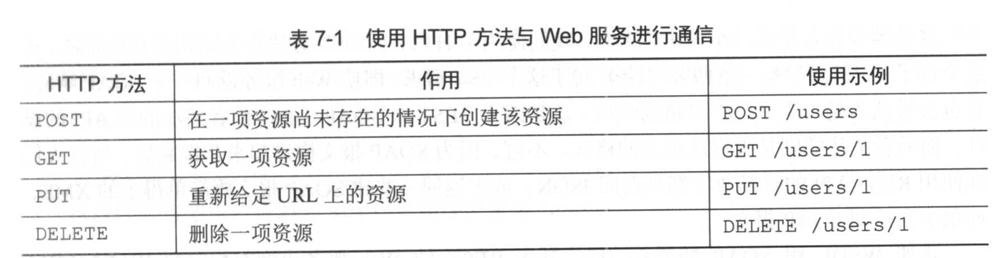
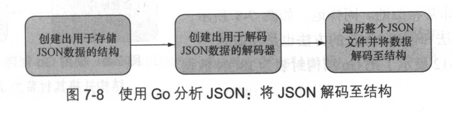
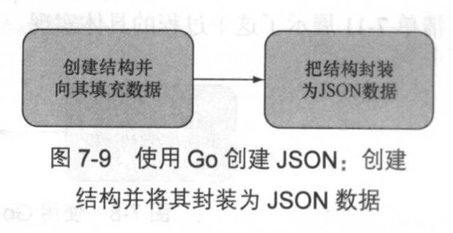
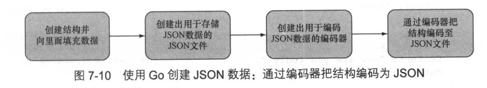

# 第7章 Go Web 服务


### 本章主要内容
- 使用 REST 风格的 Web 服务
- 使用 Go 创建和分析 XML
- 使用 Go 创建和分析 JSON
- 编写 Go Web 服务

## 7.3 基于 REST 的 Web 服务简介



POST 和 PUT 的主要区别在于，在使用 PUT 时需要准确地知道哪一项资源将会被替换，而使用 POST 只会创建出一项新资源以及一个新 URL。换句话说， POST 用于创建一项全新的资源，而 PUT 则用于替换一项已经存在的资源

PUT 是幂等的
POST 不是幂等的

## 7.4 通过 Go 分析和创建 XML

## 7.5 通过 Go 分析和创建 JSON
使用 encoding/json 库

### 7.5.1 分析 JSON
（1） 创建一些用于包含 JSON 数据的结构；
（2） 通过 json.Unmarshal 函数， 把 JSON 数据解封到结构里面

代码清单 7-9 要解析的 JSON 文件
```json
{
    "id" : 1,
    "content" : "Hello World!",
    "author" : {
        "id" : 2,
        "name" : "Sau Sheong"
    },
    "comments" : [
        {
            "id" : 3,
            "content" : "Have a great day!",
            "author" : "Adam"
        },
        {
            "id" : 4,
            "content" : "How are you today?",
            "author" : "Betty"
        }
    ]
}
```

代码清单 7-10 JSON 分析程序   P196
```go
package main

import (
    "encoding/json"
    "fmt"
    "io/ioutil"
    "os"
)

type Post struct {
    Id       int       `json:"id"`
    Content  string    `json:"content"`
    Author   Author    `json:"author"`
    Comments []Comment `json:"comments"`
}

type Author struct {
    Id   int    `json:"id"`
    Name string `json:"name"`
}

type Comment struct {
    Id      int    `json:"id"`
    Connent string `json:"connent"`
    Author  string `json:"author"`
}

func main() {
    jsonFile, err := os.Open("post.json")
    if err != nil {
        fmt.Println("Error opening JSON file:", err)
        return
    }
    defer jsonFile.Close()
    jsonData, err := ioutil.ReadAll(jsonFile)
    if err != nil {
        fmt.Println("Error reading JSON data:", err)
        return
    }

    var post Post
    json.Unmarshal(jsonData, &post)
    fmt.Println(post)
}
```

除了可以用 Unmarshal 函数来解封 JSON， 还可以使用 Decoder 手动地将 JSON 数据解码到结构里面，以此来处理流式的 JSON 数据


代码清单 7-11 使用 Decoder 对 JSON 进行语言分析   P197
```go
func main() {
    jsonFile, err := os.Open("post.json")
    if err != nil {
        fmt.Println("Error opening JSON file:", err)
        return
    }
    defer jsonFile.Close()
    
    decoder := json.NewDecoder(jsonFile)
    for {
        var post Post
        err := decoder.Decode(&post)
        if err == io.EOF {
            break
        }
        if err != nil {
            fmt.Println("Error decoding JSON:", err)
            return
        }
        fmt.Println(post)
    }
}
```

**使用 Decoder 还是 Unmarshal**
如果 JSON 数据来源于 io.Reader 流， 如 http.Request 的 Body，那么使用 Decoder 更好；如果 JSON 数据来源于字符串或者内存的某个地方，那么使用 Unmarshal 更好

### 7.5.2 创建 JSON



代码清单 7-12  将结构封装为 JSON   P199
```go
package main

import (
    "encoding/json"
    "fmt"
    "io/ioutil"
)

type Post struct {
    Id       int       `json:"id"`
    Content  string    `json:"content"`
    Author   Author    `json:"author"`
    Comments []Comment `json:"comments"`
}

type Author struct {
    Id   int    `json:"id"`
    Name string `json:"name"`
}

type Comment struct {
    Id      int    `json:"id"`
    Connent string `json:"connent"`
    Author  string `json:"author"`
}

func main() {
    post := Post{
        Id: 1, 
        Content: "Hello World!",
        Author: Author{
            Id: 2,
            Name: "Sau Sheong",
        },
        Comments: []Comment{
            {
                Id: 3,
                Connent: "Have a great day!",
                Author: "Adam",
            },
            {
                Id: 4, 
                Connent: "How are you today?",
                Author: "Betty",
            },
        },
    }
    
    output, err := json.MarshalIndent(&post, "", "\t\t")
    if err != nil {
        fmt.Println("Error marshalling to JSON:", err)
        return
    }
    err = ioutil.WriteFile("post.json", output, 0644)
    if err != nil {
        fmt.Println("Error writing JSON to file:", err)
        return
    }
}
```
通过调用 MarshalIndent 函数将结构封装为由字节切片组成的 JSON 数据

也可以通过编码器手动将 GO 结构编码为 JSON数据


代码清单 7-13 使用 Encoder 把结构编码为 JSON   P200
```go
package main

import (
    "encoding/json"
    "fmt"
    "os"
)

type Post struct {
    Id       int       `json:"id"`
    Content  string    `json:"content"`
    Author   Author    `json:"author"`
    Comments []Comment `json:"comments"`
}

type Author struct {
    Id   int    `json:"id"`
    Name string `json:"name"`
}

type Comment struct {
    Id      int    `json:"id"`
    Content string `json:"content"`
    Author  string `json:"author"`
}

func main() {
    post := Post{
        Id:      1,
        Content: "Hello World!",
        Author: Author{
            Id:   2,
            Name: "Sau Sheong",
        },
        Comments: []Comment{
            {
                Id:      3,
                Content: "Have a great day!",
                Author:  "Adam",
            },
            {
                Id:      4,
                Content: "How are you today?",
                Author:  "Betty",
            },
        },
    }
    
    jsonFile, err := os.Create("post.json")
    if err != nil {
        fmt.Println("Error creating JSON file:", err)
        return
    }
    encoder := json.NewEncoder(jsonFile)
    err = encoder.Encode(&post)
    if err != nil {
        fmt.Println("Error encoding JSON to file:", err)
        return
    }
}
```

## 7.6 创建 Go Web 服务

操作数据库的文件 data.go
```go
package main

import (
    "gorm.io/driver/mysql"
    "gorm.io/gorm"
)

var Db *gorm.DB
var post Post
var posts []Post

type Post struct {
    gorm.Model
    Id        int `gorm: "primaryKey"`
    Content   string
    Author    string `sql:not null`
    Comments  []Comment
}

type Comment struct {
    gorm.Model
    Id        int
    Content   string
    Author    string `sql:"not null"`
    PostId    int    `sql:"index"`

}

func init() {
    var err error
    dsn := "root:123456@tcp(localhost:3306)/bbs?charset=utf8mb4&parseTime=True"
    Db, err = gorm.Open(mysql.Open(dsn), &gorm.Config{})
    if err != nil {
        panic(err)
    }
    Db.AutoMigrate(&Post{}, &Comment{})

}

func Retrieve(id int) (post Post, err error)  {
    Db.First(&post, id)
    return
}

func (post *Post) Create() (err error) {
    Db.Create(&post)
    return
}

func (post *Post) Update() (err error) {
    Db.Model(&post).Updates(Post{Id: post.Id, Content: post.Content, Author: post.Author})
    return
}

func (post *Post) Delete() (err error) {
    Db.Unscoped().Delete(&post)
    return
}
```

开启 web 服务 server.go
```go
package main

import (
    "encoding/json"
    "net/http"
    "path"
    "strconv"

)


func main() {
    server := http.Server{
        Addr: "127.0.0.1:8080",
    }
    http.HandleFunc("/post/", handleRequest)
    server.ListenAndServe()
}

func handleRequest(w http.ResponseWriter, r *http.Request) {
    var err error
    switch r.Method {
    case "GET":
        err = handleGet(w, r)
    case "POST":
        err = handlePost(w, r)
    case "PUT":
        err = handlePut(w, r)
    case "delete":
        err = handleDelete(w, r)
    }
    if err != nil {
        http.Error(w, err.Error(), http.StatusInternalServerError)
        return
    }
}

func handleGet(w http.ResponseWriter, r *http.Request) (err error) {
    id, err := strconv.Atoi(path.Base(r.URL.Path))
    if err != nil {
        return
    }
    post, err := Retrieve(id)
    if err != nil {
        return
    }
    output, err := json.MarshalIndent(&post, "", "\t")
    w.Header().Set("Content-Type", "application/json")
    w.Write(output)
    return
}

func handlePost(w http.ResponseWriter, r *http.Request) (err error) {
    len := r.ContentLength
    body := make([]byte, len)
    r.Body.Read(body)
    var post Post
    json.Unmarshal(body, &post)
    err = post.Create()
    if err != nil {
        return
    }
    w.WriteHeader(200)
    return
}

func handlePut(w http.ResponseWriter, r *http.Request) (err error) {
    id, err := strconv.Atoi(path.Base(r.URL.Path))
    if err != nil {
        return
    }
    post, err := Retrieve(id)
    if err != nil {
        return
    }
    len := r.ContentLength
    body := make([]byte, len)
    r.Body.Read(body)
    json.Unmarshal(body, &post)
    err = post.Update()
    if err != nil {
        return
    }
    w.WriteHeader(200)
    return
}

func handleDelete(w http.ResponseWriter, r *http.Request) (err error) {
    id, err := strconv.Atoi(path.Base(r.URL.Path))
    if err != nil {
        return
    }
    post, err := Retrieve(id)
    if err != nil {
        return
    }
    err = post.Delete()
    if err != nil {
        return
    }
    w.WriteHeader(200)
    return
}
```

开启web服务
```
go run .
```


