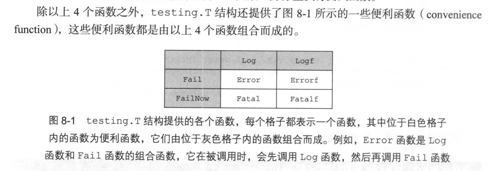
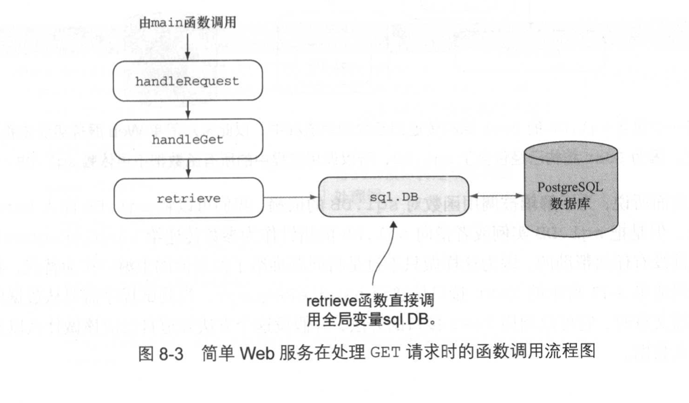
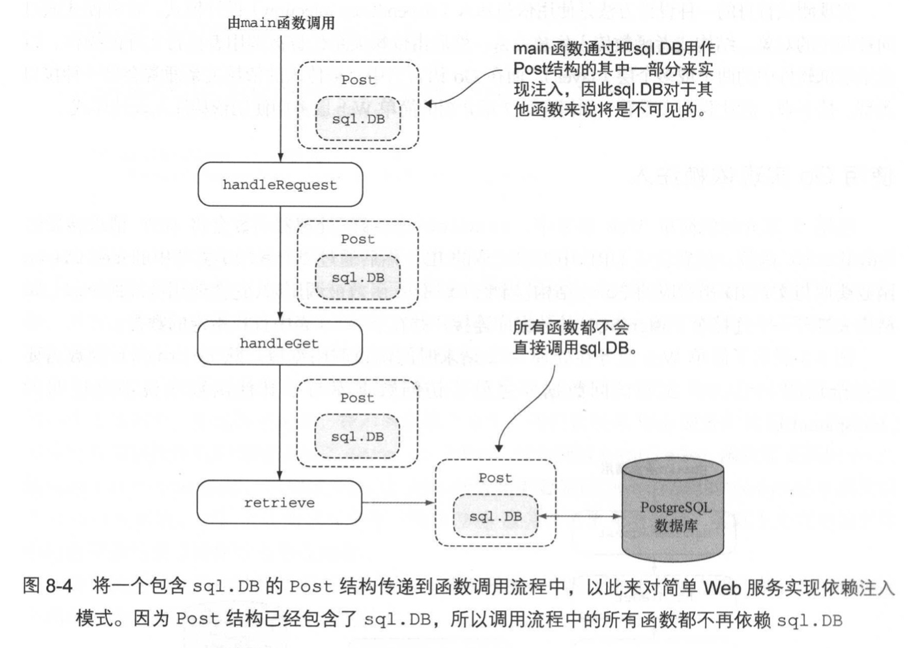

# 第8章 应用测试

本章主要内容
- Go 语言的 testing 库
- 单元测试
- HTTP 测试
- 使用依赖注入进行测试
- 使用第三方测试库


## 8.1 Go 与测试

一般来说，测试文件的名字都会与被测试源码文件的名字相对应，如 server.go和 server_test.go
另外要注意，被测试的源码文件和测试文件必须位于同一个包之内

测试函数命名规范

```
func TestXxx(*testing.T) { ... }
```
## 8.2 使用 Go 进行单元测试
单元测试（unit test），就是一种为验证单元的正确性而设置的自动化测试，一个单元就是程序中的一个模块化部分。一般来说，一个单元通常会与程序中的一个函数或者一个方法相对应

Go 的单元测试会按照功能分组，并放置在以_test.go 为后缀的文件当中

代码清单 8-1  一个 JSON 数据解码程序
```go
package main

import (
    "encoding/json"
    "fmt"
    "os"
)

type Post struct {
    Id       int       `json:"id"`
    Content  string    `json:"content"`
    Author   Author    `json:"author"`
    Comments []Comment `json:"comments"`
}

type Author struct {
    Id   int    `json:"id"`
    Name string `json:"name"`
}

type Comment struct {
    Id      int    `json:"id"`
    Content string `json:"content"`
    Author  string `json:"author"`
}

func decode(filename string) (post Post, err error) {
    jsonFile, err := os.Open(filename)
    if err != nil {
        fmt.Println("Error opening JSON file:", err)
        return
    }
    defer jsonFile.Close()

    decoder := json.NewDecoder(jsonFile)
    err = decoder.Decode(&post)
    if err != nil {
        fmt.Println("Error decoding JSON:", err)
        return
    }
    return
}

func main() {
    _, err := decode("post.json")
    if err != nil {
        fmt.Println("Error:", err)
    }
}
```

代码清单 8-2 被解码的 post.json 文件
```json
{
  "id" : 1,
  "content" : "Hello World!",
  "author" : {
    "id" : 2,
    "name" : "Sau Sheong"
  },
  "comments" : [
    {
      "id" : 3,
      "content" : "Have a great day!",
      "author" : "Adam"
    },
    {
      "id" : 4,
      "content" : "How are you today?",
      "author" : "Betty"
    }
  ]
}
```

代码清单 8-3 对 main.go 进行测试的 main_test.go 文件
```go
package main

import "testing"

func TestDecode(t *testing.T) {
    post, err := decode("post.json")
    if err != nil {
        t.Error(err)
    }
    if post.Id != 1 {
        t.Error("Wrong id, was expecting 1 but got ", post.Id)
    }
    if post.Content != "Hello World!" {
        t.Error("Wrong content, was expecting 'Hello World!', but got ", post.Content)
    }
}

func TestEncode(t *testing.T) {
    t.Skip("Skipping encoding for now")
}
```

testing.T 结构拥有几个非常有用的函数
- Log——将戈丁的文本记录到错误日志里面，与 fmt.Println 类似
- Logf——根据给定的格式，将给定的文本记录到错误日志里面，与 fmt.Printf 类似
- Fail——将测试函数标记为“已失败”， 但允许测试函数继续执行
- FailNow——将测试函数标记为“已失败”并停止测试函数


运行测试命令
go test

-v 获取详细信息
-cover 覆盖率标志 获知测试用例对代码的覆盖率
-short 短暂标志， 通过代码逻辑，跳过测试中的指定部分
```go
func TestLongunningTest(t *testing.T) {
    if testing.Short() {
        t.Skip("Skipping long-running test in short mode")
    }
    time.Sleep(10 * time.Second)
}
```

### 8.2.2 并行测试
代码清单 8-4 并行测试   P216
```go
package main

import (
    "testing"
    "time"
)

func TestParallel_1(t *testing.T) {
    t.Parallel()
    time.Sleep(1 * time.Second)
}

func TestParallel_2(t *testing.T) {
    t.Parallel()
    time.Sleep(2 * time.Second)
}

func TestParallel_3(t *testing.T) {
    t.Parallel()
    time.Sleep(3 * time.Second)
}
```
`go test -v -short -parallel 3`

### 8.2.3 基准测试
Go 的 testing 包支持两种类型测试
- 用于检验程序功能性的功能测试（functional testing）
- 用于查明任务单元性能的基准测试（benchmarking）

基准测试用例需要以_test.go为后缀的文件
每个基准测试函数都需要符合以下格式：
`func BenchmarkXxx(*teseting.B) {...}`

代码清单 8-5 基准测试
```go
// benchmarking the decode function
func BenchmarkDecode(b *testing.B) {
    for i := 0; i < b.N; i++ {
        decode("post.json")
    }
}
```
-bench 后跟一个正则表达式做为参数，指定想要运行的基准测试文件，"." 表示运行目录下的所有基准测试文件
`go test -v -cover -short -bench .`

-run 标志用于指定需要被执行的功能测试用例，如果指定一个不存在的功能测试名字，那么所有功能测试都会被忽略。
以下命令表示忽略所有功能测试
`go test -run x -bench .`

对比 Decode 函数 和 Unmarshal 函数的运行速度

在 main.go 中重构 unmarshal 函数
代码清单 8-6 解封 JSON 数据的函数
```go
package main

import (
    "encoding/json"
    "fmt"
    "io/ioutil"
    "os"
)

func unmarshal(filename string) (post Post, err error) {
    jsonFile, err := os.Open(filename)
    if err != nil {
        fmt.Println("Error opening JSON file:", err)
        return
    }
    defer jsonFile.Close()

    jsonData, err := ioutil.ReadAll(jsonFile)
    if err != nil {
        fmt.Println("Error reading JSON data: ", err)
        return
    }
    json.Unmarshal(jsonData, &post)
    return
}
```
添加main函数部分
```go
    _, err = unmarshal("post.json")
    if err != nil {
        fmt.Println("Error:", err)
    }
```

添加基准测试函数
```go
func BenchmarkUnmarshal(b *testing.B) {
    for i := 0; i < b.N; i++ {
        unmarshal("post.json")
    }
}
```
`go test -run x -bench .`

```
erniudeMacBook-Pro:test erniu$ go test -run x -bench .
goos: darwin
goarch: amd64
pkg: erniu.fun
cpu: Intel(R) Core(TM) i5-5287U CPU @ 2.90GHz
BenchmarkDecode-4          53730         23010 ns/op
BenchmarkUnmarshal-4       49989         21972 ns/op
PASS
ok      erniu.fun   2.835s
```

## 8.3 使用 Go 进行 HTTP 测试
对 Go Web 应用的单元测试可以通过 testing/httptest 包来完成。 这个包提供了模拟一个 Web 服务器所需的设施，用户可以利用 net/http 包中的客户端函数向这个服务器发送 HTTP 请求，然后获取模拟服务器返回的 HTTP 响应

代码清单 8-9 使用 GET 请求进行测试
```go
package main

import (
    "encoding/json"
    "net/http"
    "net/http/httptest"
    "testing"
)

func TestHandleGet(t *testing.T) {
    mux := http.NewServeMux()  // 创建一个用于测试的多路复用器
    mux.HandleFunc("/post/", handleRequest)   // 绑定想要测试的处理器
    
    // 创建一个 ResponseRecorder 结构，把响应存储起来进行后续检查
    writer := httptest.NewRecorder()
    request, _ := http.NewRequest("GET", "/post/1", nil)  // 为被测试的处理器创建相应的请求
    mux.ServeHTTP(writer, request)  // 向被测试的处理器发送请求
    
    if writer.Code != 200 {    // 对记录器记载的响应结果进行检查
        t.Errorf("Response code is %v", writer.Code)
    }
    
    var post Post
    json.Unmarshal(writer.Body.Bytes(), &post)
    if post.Id != 1 {
        t.Error("Cannot etrieve JSON post")
    }
    
}
```

代码清单 8-10 对 PUT 请求进行测试  P222
```go
func TestHandlePut(t *testing.T) {
    mux := http.NewServeMux()
    mux.HandleFunc("/post/", handleRequest)

    writer := httptest.NewRecorder()
    json := strings.NewReader(`{"content":"Updated post", "author": "Sau Sheong"`)
    request, _ := http.NewRequest("PUT", "/post/1", json)
    mux.ServeHTTP(writer, request)

    if writer.Code != 200 {
        t.Errorf("Response code is %v", writer.Code)
    }
}
```

Go 的 testing 包允许用户通过 TestMain 函数，在进行测试时执行相应的预设（setup）操作或者拆卸（teardown）操作
```go
 func TestMain(m *testing.M) {
    setUp()
    code := m.Run()
    tearDown()
    os.Exit(code)
 }
```

代码清单 8-11 使用 httptest 包的 TestMain 函数
```go
package main

import (
    "encoding/json"
    "net/http"
    "net/http/httptest"
    "os"
    "strings"
    "testing"
)

var mux *http.ServeMux
var writer *httptest.ResponseRecorder

func TestMain(m *testing.M)  {
    setUp()
    code := m.Run()
    os.Exit(code)
}

func setUp() {
    mux = http.NewServeMux()
    mux.HandleFunc("/post/", handleRequest)
    writer = httptest.NewRecorder()
}

func TestHandleGet(t *testing.T) {
    request, _ := http.NewRequest("GET",  "/post/1", nil)
    mux.ServeHTTP(writer, request)
    
    if writer.Code != 200 {
        t.Errorf("Response code is %v", writer.Code)
    }
    var post Post
    json.Unmarshal(writer.Body.Bytes(), &post)
    if post.Id != 1 {
        t.Errorf("Cannot retrieve JSON post")
    }
    
}

func TestHandlePut(t *testing.T)  {
    json := strings.NewReader(`{"content":"Updated post", "author":"Sau Sheong"`)
    request, _ := http.NewRequest("PUT", "/post/1", json)
    mux.ServeHTTP(writer, request)
    
    if writer.Code != 200 {
        t.Errorf("Response code is %v", writer.Code)
    }
}
```

## 8.4 测试替身以及依赖注入
测试提升（test double）是一种能够让单元测试用例变得更为独立的常用方法
使用测试替身的一种设计方法是使用**依赖和注入**（dependency injection）设计模式

原来的Get请求时函数调用流程


移除对 sql.DB 的依赖并将这种依赖通过主程序注入函数调用流程中的具体方法


## 8.5 第三方 Go 测试库
Gocheck 和 Ginkgo

### 8.5.1 Gocheck 测试包简介
- 以套件（suit）为单位对测试进行分组
- 为每个测试套件或者测试用例分别设置测试夹具
- 带有可扩展检查器的接口的断言
- 更多错误报告辅助函数
- 与 testing 包紧密集成

下载安装 check 包
`go get gopkg.in/check.v1`

### 8.5.2 Ginkgo 测试框架简介
Ginkgo 是一个行为驱动开发（behavior-driven development， BDD）风格的 Go 测试框架

安装 Ginkgo
```shell
go get github.com/onsi/ginkgo/ginkgo
go get github.com/onsi/gomega
```
第一条命令下载 Ginkgo 并将命令行接口程序 ginkgo 安装到 $GOPATH/bin 目录中，而第二条命令则会下载 Ginkgo 默认的匹配器库 Gomega（匹配器可以对比两个不同的组件，这些组件可以是结构、映射、字符串等）
