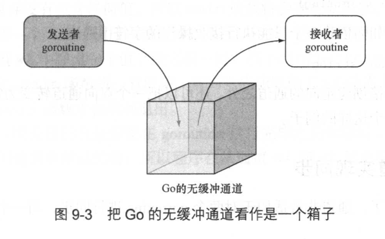
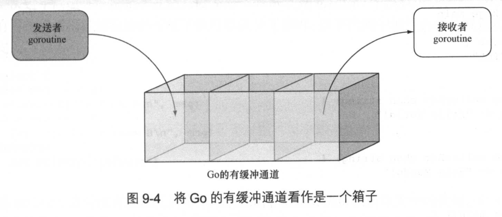

# 第9章 发挥 Go 的并发优势

**本章主要内容**
- 从原理上理解并发和并行
- 学习如何使用 goroutine 以及通道
- 在 Web 应用中使用并发特性

## 9.1 并发与并行的区别
并发（concurrency）指的是两个或多个任务在同一时间段内启动、运行并结束，并且这些任务可能会互动。
对于并发来说，多个任务并不需要同时开始或者同时结束
并发执行的多个任务会被调度，并且它们会通过通信分享数据并协调执行时间（不过这种通信并不是必须的）

并行（parallelism），多个任务将同时启动并执行。并行通常会把一个大任务分割成多个更小的任务，然后通过同时执行这些小任务来提高性能

并行通常需要独立的资源（如CPU）， 而并发则会使用和分享相同的资源

并发指的是同时处理多项任务， 而并行指的是同时执行多项任务  ———— Rob Pike

## 9.2 goroutine
goroutine 指的是哪些独立于其他 goroutine 运行的函数
goroutine 不是线程， 它只是对线程的多路复用
当一个 goroutine 被阻塞时，它也会阻塞所服用的操作系统线程，而运行时环境（runtime）则会把位于被阻塞线程上的其他 goroutine 移动到其他未阻塞的线程上继续运行

### 9.2.1 使用 goroutine
goroutine 的用法非常简单：只要把 go 关键字添加到任意一个具名函数或者匿名函数的前面， 该函数就会成为一个 goroutine

代码清单 9-1 goroutine 使用示例   P246
```go
package main

import (
    "fmt"
    "time"
)

func printNumbers1() {
    for i := 0; i < 10; i++ {
        fmt.Printf("%d", i)
    }
}

func printNumbers2() {
    for i := 0; i < 10; i++ {
        time.Sleep(1 * time.Millisecond)
        fmt.Printf("%d", i)
    }
}

func printLetters1() {
    for i := 'A'; i < 'A'+10; i++ {
        fmt.Printf("%c", i)
    }
}

func printLetters2() {
    for i := 'A'; i < 'A'+10; i++ {
        time.Sleep(1 * time.Millisecond)
        fmt.Printf("%c", i)
    }
}

func print1() {
    printNumbers1()
    printLetters1()
}

func goPrint1() {
    go printNumbers1()
    go printLetters1()
}

func goPrint2() {
    go printNumbers2()
    go printLetters2()
}

func main() {

}
```

代码清单 9-2 运行 goroutine 示例的测试文件
```go
package main

import (
    "testing"
    "time"
)

func TestPrint1(t *testing.T) {
    print1()
}

func TestGoPrint1(t *testing.T) {
    goPrint1()
    time.Sleep(1 * time.Millisecond)
}

func TestGoPrint2(t *testing.T) {
    goPrint2()
    time.Sleep(1 * time.Millisecond)
}
```

### 9.2.2 goroutine 与性能
增加 CPU 的数量并不一定会带来性能提升，更重要的是要理解代码，并对其进行基准测试，以了解它的性能特质

### 9.2.3 等待 goroutine
sync 包中提供了一种名为等待组（WatiGroup）的机制，运作方式：
- 生命一个等待组
- 使用 Add 方法为等待组的计数器设置值
- 当一个 goroutine 完成它的工作时， 使用 Done 方法对等待组的计数器执行减一操作
- 调用 Wait 方法，该方法将一直阻塞，直到等待组计数器的值变为0

代码清单 9-6 使用等待组   P252
```go
package main

import (
    "fmt"
    "sync"
    "time"
)

func printNumbers2(wg *sync.WaitGroup) {
    for i := 0; i < 10; i++ {
        time.Sleep(1 * time.Millisecond)
        fmt.Printf("%d ", i)
    }
    wg.Done()
}

func printLetters2(wg *sync.WaitGroup) {
    for i := 'A'; i < 'A'+10; i++ {
        time.Sleep(1 * time.Millisecond)
        fmt.Printf("%c ", i)
    }
    wg.Done()
}

func main() {
    var wg sync.WaitGroup
    wg.Add(2)
    go printNumbers2(&wg)
    go printLetters2(&wg)
    wg.Wait()
}
```

## 9.3 通道

通道（channel）是一种带有类型的值（typed value），它可以让不同的 goroutine 互相通信
通道用 make 函数创建，该函数在被调用之后将返回一个指向底层数据机构的引用作为结果值

创建一个由整数组成的通道：
`ch := make(chan int)`

带缓冲的整数通道
`ch := make(chan int, 10)`

将数字1 放入通道
`ch <- 1`

从通道 ch 里面移除一个值，并将该值赋予变量 i 
` i := <- ch`

通道可以是定向的（directional）。在默认情况下，通道将以双向（bidirectional）形式运作
通道也可以被限制**只能执行发送操作**（send-only）或者**只能执行接收操作**（receive-only）

创建一个只能执行发送操作的字符串通道
`ch := make(chan <- string)`

创建一个只能执行接收操作的字符串通道
`ch := make(<-chan string)`

### 9.3.1 通过通道实现同步
代码清单 9-7 使用通道同步 goroutine
```go
package main

import (
    "fmt"
    "time"
)

func printNumbers2(w chan bool) {
    for i := 0; i < 10; i++ {
        time.Sleep(1 * time.Millisecond)
        fmt.Printf("%d ", i)
    }
    w <- true
}

func printLetters2(w chan bool) {
    for i := 'A'; i < 'A'+10, i++{
        time.Sleep(1 * time.Millisecond)
        fmt.Printf("%c ", i)
    }
    w <- true
}

func main() {
    w1, w2 := make(chan bool), make(chan bool)
    go printNumbers2(w1)
    go printLetters2(w2)
    <-w1
    <-w2
}
```

### 9.3.2 通过通道实现消息传递
代码清单 9-8 使用通道实现消息传递
```go
package main

import (
    "fmt"
    "time"
)

func thrower(c chan int) {
    for i := 0; i < 5; i++ {
        c <- i
        fmt.Println("Threw >> ", i)
    }
}

func catcher(c chan int) {
    for i := 0; i < 5; i++ {
        num := <-c
        fmt.Println("Caught << ", num)
    }
}

func main() {
    c := make(chan int)
    go thrower(c)
    go catcher(c)
    time.Sleep(100 * time.Millisecond)
}
```

### 9.3.3 有缓冲通道
有缓冲通道是一种异步的、先进先出的消息队列


如果你在解决某个问题的时候，只有有限数量的工作进程可用，并且你打算限制传入请求的数量，那么有缓冲的通道将是一种非常合适的工具

### 9.3.4 从多个通道中选择
Go 拥有一个特殊的关键字 select， 它允许用户从多个通道中选择一个通道来执行接收或者发送操作。
select 关键字就想是专门为通道而设的 switch 语句

代码清单 9-9 从多个通道中选择   P258
```go
package main

import (
    "fmt"
    "time"
)

func callerA(c chan string) {
    c <- "Hello World!"
}

func callerB(c chan string) {
    c <- "Hola Mundo!"
}

func main() {
    a, b := make(chan string), make(chan string)
    go callerA(a)
    go callerB(b)
    for i := 0; i < 5; i++ {
        time.Sleep(1 * time.Microsecond)
        select {
        case msg := <-a:
            fmt.Printf("%s from A\n", msg)
        case msg := <-b:
            fmt.Printf("%s from B\n", msg)
        default:
            fmt.Println("Default")
        }
    }
}
```

使用 close 函数关闭通道，相当于向通道接收者表明该通道不会再接收到任何值。
只能执行接收操作的通道无法被关闭
尝试向一个已关闭的通道发送信息将会引发一个 panic
尝试关闭一个已经关闭的通道也会引发一个 panic
尝试从一个已关闭的通道取值总是会得到一个与通道类型相对应的零值，因此从已关闭的通道取值不会导致 goroutine 被阻塞

在这个例子中，我们将会看到关闭通道的方法以及被关闭通道是如何帮助程序跳出无限循环的

代码清单 9-10 关闭通道
```go
package main

import "fmt"

func callerA(c chan string) {
    c <- "Hello World!"
    close(c)
}

func callerB(c chan string) {
    c <- "Hola Mundo!"
    close(c)
}

func main() {
    a, b := make(chan string), make(chan string)
    go callerA(a)
    go callerB(b)
    var msg string
    ok1, ok2 := true, true
    for ok1 || ok2 {
        select {
        case msg, ok1 = <-a:
            if ok1 {
                fmt.Printf("%s from A\n", msg)
            }
        case msg, ok2 = <-b:
            if ok2 {
                fmt.Printf("%s from B\n", msg)
            }
        }
    }
}
```
关闭通道并不是必需的。关闭通道只不过是在告知接收者该通道不会再接收到任何值而已

## 9.4 在 Web 应用中使用并发
创建一个对图片进行马赛克处理，一次来生成马赛克图片的Web应用

### 9.4.1 创建马赛克图片
mosaic.go   P262
```go
package main

import (
    "fmt"
    "image"
    "image/color"
    "io/ioutil"
    "math"
    "os"
)

// 计算平均颜色的 averageColor 函数
// averageColor 函数会把给定的图片的每个像素中的红、绿、蓝3种颜色相加起来，并将这些颜色的总和除以图片的像素数量，
// 最后把除法计算结果记录在一个新创建的三元组里面 P263
func averageColor(img image.Image) [3]float64 {
    bounds := img.Bounds()
    r, g, b := 0.0, 0.0, 0.0
    for y := bounds.Min.Y; y < bounds.Max.Y; y++ {
        for x := bounds.Min.X; x < bounds.Max.X; x++ {
            r1, g1, b1, _ := img.At(x, y).RGBA()
            r, g, b = r+float64(r1), g+float64(g1), b+float64(b1)
        }
    }
    totalPixels := float64(bounds.Max.X * bounds.Max.Y)
    return [3]float64{r / totalPixels, g / totalPixels, b / totalPixels}
}

// resize函数， 把图片缩放至指定的宽度
func resize(in image.Image, newWidth int) image.NRGBA {
    bounds := in.Bounds()
    ratio := bounds.Dx() / newWidth
    out := image.NewNRGBA(image.Rect(bounds.Min.X/ratio, bounds.Min.X/ratio,
        bounds.Max.X/ratio, bounds.Max.Y/ratio))
    for y, j := bounds.Min.Y, bounds.Min.Y; y < bounds.Max.Y; y, j = y+ratio, j+1 {
        for x, i := bounds.Min.X, bounds.Min.X; x < bounds.Max.X; x, i = x+ratio, x+1 {
            r, g, b, a := in.At(x, y).RGBA()
            out.SetNRGBA(i, j, color.NRGBA{uint8(r >> 8), uint8(g >> 8), uint8(b >> 8), uint8(a >> 8)})
        }
    }
    return *out
}

// tilesDB 函数 通过扫描瓷砖图片所在的目录来创建一个瓷砖图片数据库
func titlesDB() map[string][3]float64 {
    fmt.Println("Start populating titles db ...")
    db := make(map[string][3]float64)
    files, _ := ioutil.ReadDir("titles")
    for _, f := range files {
        name := "titles/" + f.Name()
        file, err := os.Open(name)
        if err == nil {
            img, _, err := image.Decode(file)
            if err == nil {
                db[name] = averageColor(img)
            } else {
                fmt.Println("error in populating TILEDB:", err, name)
            }
        } else {
            fmt.Println("cannot open file", name, err)
        }
        file.Close()
    }
    fmt.Println("Finished populating titles db.")
    return db
}

// nearest 函数会把词组行图片数据库中国呢的搜有记录与目标图片的平均颜色一一进行对比，
// 而两者欧几里得距离最短的那一条记录，就是与目标图片平均颜色最为接近的瓷砖图片。
// 函数会从数据库中移除被选中的瓷砖图片，并把该图片的名字返回给调用者
func nearest(target [3]float64, db *map[string][3]float64) string {
    var filename string
    smallest := 1000000.0
    for k, v := range *db {
        dist := distance(target, v)
        if dist < smallest {
            filename, smallest = k, dist
        }
    }
    delete(*db, filename)
    return filename
}

// distance 计算三元组之间的欧几里得距离
func distance(p1 [3]float64, p2 [3]float64) float64 {
    return math.Sqrt(sq(p2[0]-p1[0]) + sq(p2[1]-p1[1]) + sq(p2[2]-p1[2]))
}

func sq(n float64) float64 {
    return n * n
}

var TILESDB map[string][3]float64

// cloneTitlesDB 作为瓷砖图片数据库的原本而存在的TILEDB 全局变量
// Web 应用在启动的时候就会创建并填充这个变量
func cloneTitlesDB() map[string][3]float64 {
    db := make(map[string][3]float64)
    for k, v := range TILESDB {
        db[k] = v
    }
    return db
}
```
### 9.4.2 马赛克图片 Web 应用
main.go   P265
```go
package main

import (
    "bytes"
    "encoding/base64"
    "fmt"
    "html/template"
    "image"
    "image/draw"
    "image/jpeg"
    "net/http"
    "os"
    "strconv"
    "time"
)

func main() {
    mux := http.NewServeMux()
    files := http.FileServer(http.Dir("public"))
    mux.Handle("/static/", http.StripPrefix("/static/", files))
    mux.HandleFunc("/", upload)
    mux.HandleFunc("/mosaic", mosaic)
    server := &http.Server{
        Addr:    "127.0.0.1:8080",
        Handler: mux,
    }

    TILESDB = titlesDB()
    fmt.Println("Mosaic server started.")
    server.ListenAndServe()
}

func upload(w http.ResponseWriter, r *http.Request) {
    t, _ := template.ParseFiles("upload.html")
    t.Execute(w, nil)
}

// mosaic 函数是一个处理器函数，在这个函数里包含了用于生成马赛克图片的主要逻辑
// 首先， 程序会获取用户上传的目标图片，并从表单中干活去瓷砖图片的尺寸；
// 接着， 程序会对目标图片进行解码，并创建出一张全新的、空白的马赛克图片；
// 之后， 程序会复制一份瓷砖图片数据库，并为每张瓷砖图片设置起始点，而这一起始点将在稍后的代码中被image/draw所使用
// 完成了上述准备工作之后，程序就可以开始对目标图片分割出的各张瓷砖图片尺寸的子图片进行迭代了
// 详见 P267
func mosaic(w http.ResponseWriter, r *http.Request) {
    t0 := time.Now()

    r.ParseMultipartForm(10485760)
    // 获取用户上传的目标图片，以及瓷砖图片的尺寸
    file, _, _ := r.FormFile("image")
    defer file.Close()
    tileSize, _ := strconv.Atoi(r.FormValue("tile_size"))

    // 对用户上传的目标图片进行解码
    original, _, _ := image.Decode(file)
    bounds := original.Bounds()

    newimage := image.NewNRGBA(image.Rect(bounds.Min.X, bounds.Min.X,
        bounds.Max.X, bounds.Max.Y))

    // 复制瓷砖图数据库
    db := cloneTitlesDB()

    // 为每张瓷砖图片设置起始点
    sp := image.Point{0, 0}
    // 对目标图片分割出的每张子图进行迭代
    for y := bounds.Min.Y; y < bounds.Max.Y; y = y + tileSize {
        for x := bounds.Min.X; x < bounds.Max.X; x = x + tileSize {
            r, g, b, _ := original.At(x, y).RGBA()
            color := [3]float64{float64(r), float64(g), float64(b)}

            nearest := nearest(color, &db)
            file, err := os.Open(nearest)
            if err == nil {
                img, _, err := image.Decode(file)
                if err == nil {
                    t := resize(img, tileSize)
                    tile := t.SubImage(t.Bounds())
                    tileBounds := image.Rect(x, y, x+tileSize, y+tileSize)
                    draw.Draw(newimage, tileBounds, tile, sp, draw.Src)
                } else {
                    fmt.Println("error: ", err, nearest)
                }
            } else {
                fmt.Println("error: ", nearest)
            }
            file.Close()
        }
    }

    buf1 := new(bytes.Buffer)
    // 将图片编码为 JPEG 格式， 然后通过 base64 字符串将其传输至浏览器
    jpeg.Encode(buf1, original, nil)
    originalStr := base64.StdEncoding.EncodeToString(buf1.Bytes())

    buf2 := new(bytes.Buffer)
    jpeg.Encode(buf2, newimage, nil)
    mosaic := base64.StdEncoding.EncodeToString(buf2.Bytes())
    t1 := time.Now()
    images := map[string]string{
        "original": originalStr,
        "mosaic":   mosaic,
        "duration": fmt.Sprintf("%v ", t1.Sub(t0)),
    }
    t, _ := template.ParseFiles("results.html")
    t.Execute(w, images)

}
```
### 9.4.3 并发版马赛克图片生成 Web 应用
(1) 将用户上传的目标图片分割为4等份
(2) 同时对被分割的4张子图片进行马赛克处理
(3) 将处理完的4张子图片重新合并为1张买塞克图片

**竞争条件**
如果一个程序在执行时依赖于特定的顺序或时序，但是又无法保证这种顺序或时序，此时就会存在竞争条件（race condition）。竞争条件的存在将导致程序的行为变得飘忽不定而且难以预测。
竞争条件通常出现在那些需要修改共享资源的并发程序当中。当有两个或多个进程或线程同时去修改一项共享资源时，最先访问资源的那个进程/线程将得到预期的结果，而其他进程/线程则不然。最终因为程序无法判断哪个进程/线程最先访问了资源，所以它将无法产生一致的行为。
虽然竞争条件一般都不太好发现，但修复一个已判明的竞争条件通常来说并不是一件难事

