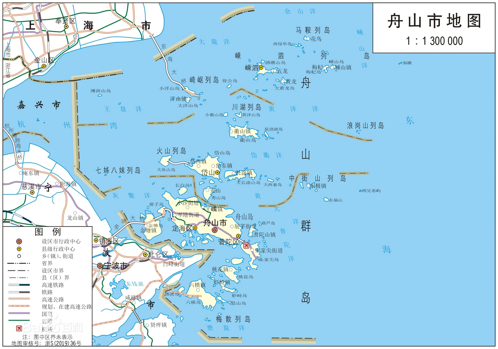

# 我的家乡——舟山

## 简介

### 地理
舟山市是浙江省辖地级市，位于浙江省东北部，东临东海、西靠杭州湾、北界上海市。

地势由西南向东北倾斜，南部岛大，海拔高，排列密集；北部岛小，地势低，分布稀疏。

共有大小岛屿1390个，礁3306座，其中有人居住的岛屿有103个，户籍人口50人以上岛屿67个

### 气侯
与浙江省大陆地区相比，舟山气候有着显著的海洋性。首先是换季日期都比同纬度的浙江大陆城市（如杭州）偏晚。然后是最热月平均高温比杭州低2℃以上，高温（≥35℃）日数偏少20天以上，是良好的避暑胜地，最冷月平均气温比杭州偏高1℃以上，降雪日数则明显偏少。

舟山常年换季日期

|       |春季 |夏季|秋季|冬季|
|----   |----|----|----|----|
|换季日期|3月15日|6月8日|10月2日|12月8日|
|平均时长|85天|116天|67天|97天|
|杭州常年换季|3月10日|5月20日|9月30日|11月28日|
|滞后天数|5天|19天|2天|10天|

空气质量方面，受海洋影响，舟山的空气质量极佳，不仅远远优于浙江省其他地区，在全国也常年稳居地级市前三。

### 行政区划
舟山市现辖2区2县
2区：定海区、普陀区
2县：岱山县、嵊泗县

### 经济
舟山自古以来便是“以渔而生，以渔而兴”，改革开放前，舟山整个经济一直以第一产业为主。随着大量的农田被用于城市建设，农业占比持续下降，至2018年，渔业已升至占第一产业总产值的95%。

### 交通
2009年底，舟山跨海大桥建成通车，结束了舟山群岛至浙江大陆只能通过轮船运输的历史。
2019年3月，甬舟铁路全面启动勘察设计。该铁路建成后，将结束舟山群岛不通火车的历史。

### 名人
林郑月娥、 董建华、 三毛

## 舟山旅游
普陀山

朱家尖

东极岛

枸杞岛

桃花岛

**衢山岛**

